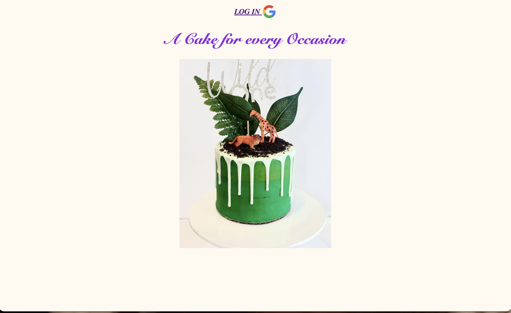
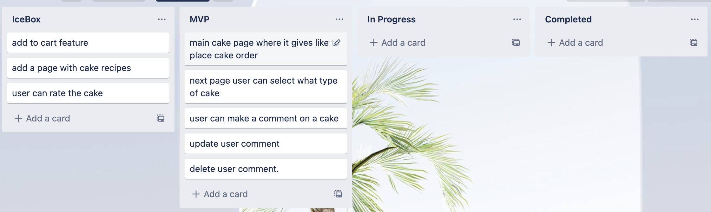

# Cake Ordering app

This cake app is used to place an order for a cake to celebrate any special occasion that life has to offer! You can choose from a varity of options and make any special request on any cake order.

## planning

#### Technologies Used
JaveScript, MongoDB, Mongoose, Express, Html, Css.

#### Next steps
Add feature where user can rate the cakes.
Add a page where there are recipes for the cakes.
Add to cart feature.
